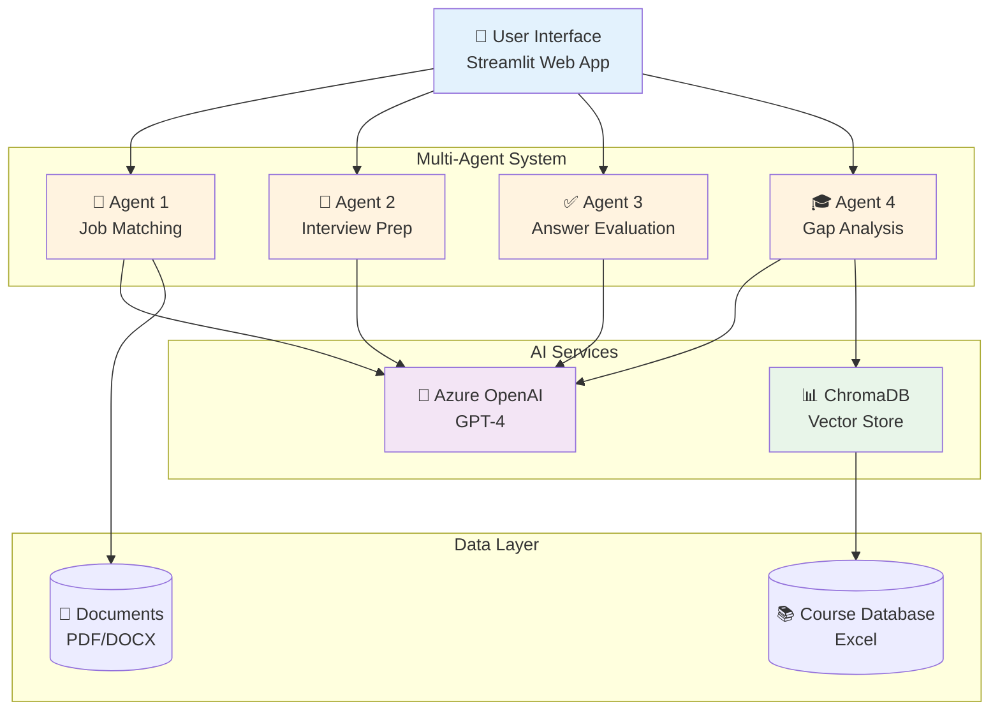
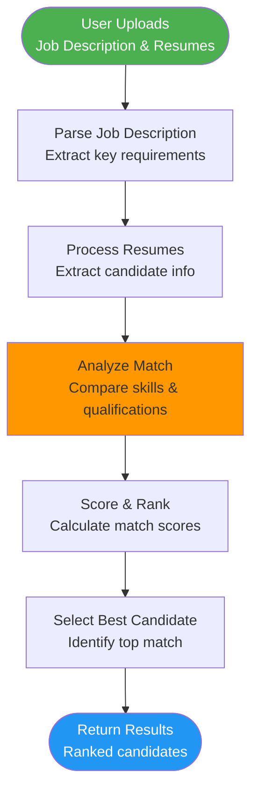
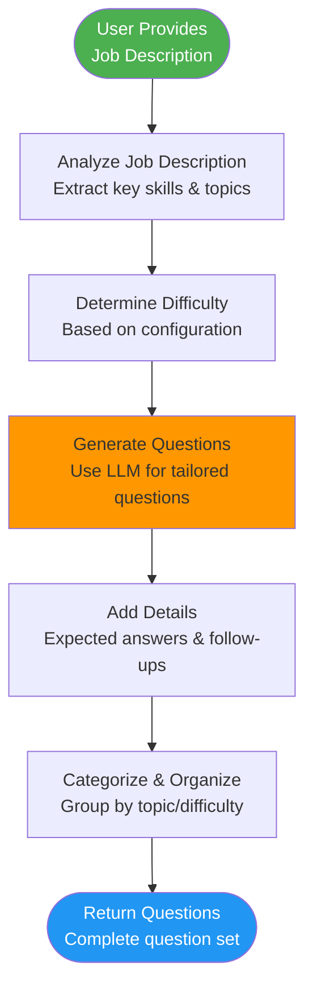
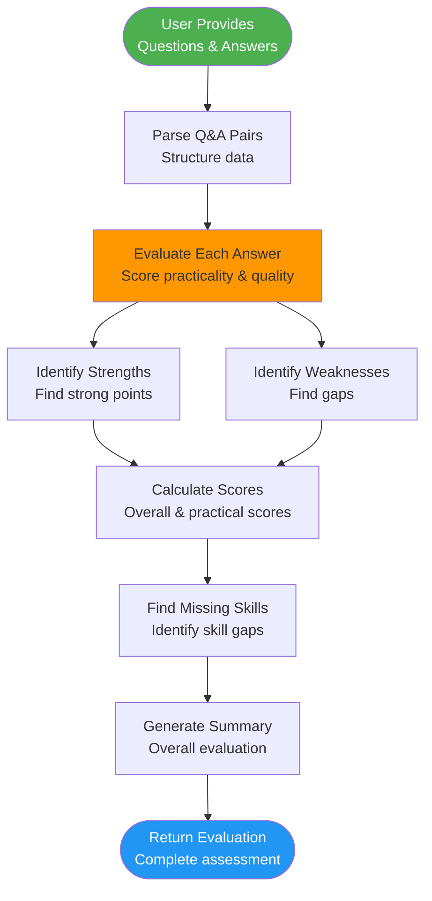
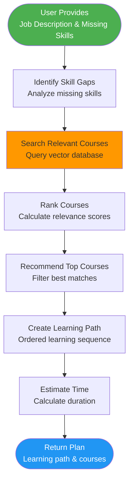
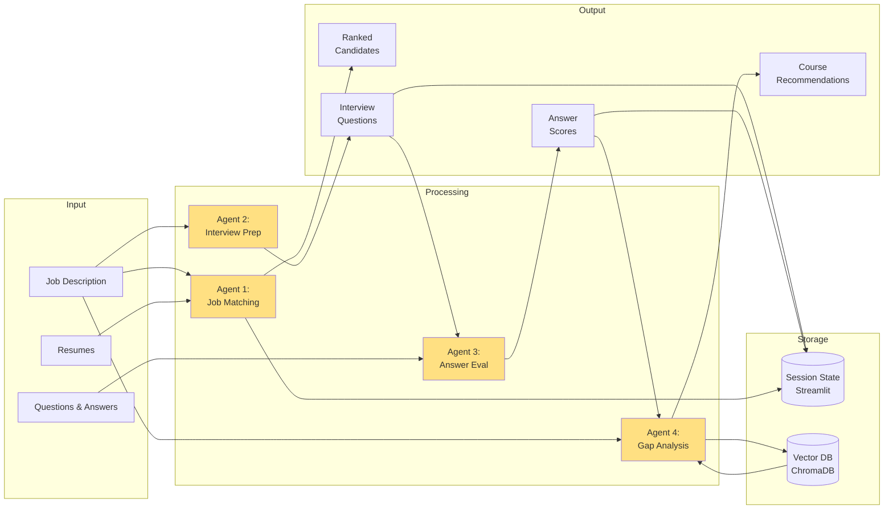

# System Architecture & Implementation Documentation

## Multi-Agent AI System

---

## 📋 Table of Contents

1. [System Overview](#system-overview)
2. [High-Level Architecture](#high-level-architecture)
3. [Agent Pipeline Process](#agent-pipeline-process)
4. [Data Flow](#data-flow)
5. [Technology Stack](#technology-stack)
6. [Implementation Details](#implementation-details)

---

## 🏗️ System Overview

This is a **Multi-Agent AI System** designed to streamline recruitment and learning processes using advanced AI technologies. The system consists of four specialized agents that work independently while sharing data through a common state management system.

### Key Features:
- **Multi-Agent Architecture**: Four specialized agents for different tasks
- **LangGraph Framework**: Orchestration of complex AI workflows
- **Azure OpenAI Integration**: Powered by GPT-4 for intelligent processing
- **Vector Database**: ChromaDB for efficient course recommendations
- **Streamlit UI**: User-friendly web interface

---

## 🎯 High-Level Architecture



---

## 🔄 Agent Pipeline Process

### Agent 1: Job Matching Pipeline



### Agent 2: Interview Prep Pipeline



### Agent 3: Answer Evaluation Pipeline



### Agent 4: Gap Analysis Pipeline



---

## 💾 Data Flow Diagram



---

## 🛠️ Technology Stack

### Frontend
- **Streamlit**: Web application framework
- **Python**: Core programming language

### AI/ML Stack
- **Azure OpenAI**: GPT-4o for natural language processing
- **LangGraph**: Agent orchestration framework
- **LangChain**: LLM application framework
- **ChromaDB**: Vector database for embeddings

### Data Processing
- **pandas**: Data manipulation
- **openpyxl**: Excel file processing
- **PyPDF2**: PDF parsing
- **python-docx**: DOCX parsing

### State Management
- **Pydantic**: Data validation using Python type hints
- **Dataclasses**: Structured state management

### Logging & Monitoring
- **Python logging**: Built-in logging framework
- **Custom Logger Module**: Centralized logging configuration (`src/utils/logger.py`)
- **Rotating File Handlers**: Automatic log rotation (10 MB max, 5 backups)
- **Multi-level Logging**: DEBUG, INFO, WARNING, ERROR, CRITICAL
- **Separate Error Logs**: Dedicated error tracking in `logs/error.log`

---

## 📐 Implementation Details

### Agent State Management

Each agent maintains its own state using Pydantic models:

```python
# Example: Job Match State
class JobMatchState(TypedDict):
    job_description_text: str
    job_description: Optional[JobDescription]
    resumes: List[Dict[str, str]]
    parsed_resumes: List[Resume]
    candidate_matches: List[CandidateMatch]
    best_candidate: Optional[CandidateMatch]
    error: Optional[str]
```

### LangGraph Workflow

Each agent is built as a directed graph:

```python
def build(self):
    builder = StateGraph(StateType)
    
    # Add nodes
    builder.add_node("parse", self.parse_node)
    builder.add_node("analyze", self.analyze_node)
    builder.add_node("rank", self.rank_node)
    
    # Define edges
    builder.add_edge("parse", "analyze")
    builder.add_edge("analyze", "rank")
    
    # Set entry point
    builder.set_entry_point("parse")
    
    # Compile graph
    self.graph = builder.compile()
```

### Vector Store Integration

Agent 4 uses ChromaDB for course recommendations:

```python
class CourseVectorStore:
    def __init__(self):
        self.client = chromadb.Client()
        self.collection = self.client.create_collection("courses")
    
    def search_courses(self, query: str, n_results: int = 5):
        results = self.collection.query(
            query_texts=[query],
            n_results=n_results
        )
        return results
```

### Session State Persistence

Streamlit session state maintains data across interactions:

```python
if 'job_match_result' not in st.session_state:
    st.session_state.job_match_result = None

# Results persist across reruns
result = st.session_state.job_match_result
```

### Logging System Architecture

Professional logging system for debugging and production monitoring:

```python
from src.utils.logger import get_logger

# Get logger for any module
logger = get_logger(__name__)

# Automatic logging of:
# - Agent initialization
# - Workflow execution
# - LLM requests/responses
# - Errors with stack traces
logger.info("Processing started")
logger.error("Error occurred", exc_info=True)
```

**Log Structure:**
- `logs/application.log` - All application logs (INFO and above)
- `logs/error.log` - Critical errors only
- Automatic rotation: 10 MB max file size, 5 backup files
- Format: `timestamp - module - level - function:line - message`

---

## 📊 Weighted Scoring Formulas

### Agent 1: Job Matching Score

The job matching algorithm uses a **weighted scoring system** that prioritizes PRIMARY (required) skills over SECONDARY (preferred) skills.

#### Formula

```
Weighted Match Score = (Wp × Sp) + (Ws × Ss)
```

Where:
- **Wp** = Weight for Primary Skills = **0.7** (70%)
- **Sp** = Similarity Score for Primary Skills (0-100)
- **Ws** = Weight for Secondary Skills = **0.3** (30%)
- **Ss** = Similarity Score for Secondary Skills (0-100)

#### Calculation Steps

1. **Parse Job Description**
   - Extract PRIMARY skills (must-have, required, core)
   - Extract SECONDARY skills (nice-to-have, preferred, optional)

2. **Calculate Primary Skills Score (Sp)**
   ```
   Sp = (Matched Primary Skills / Total Primary Skills) × 100
   ```
   Example: If 6 out of 8 primary skills match → Sp = 75.0

3. **Calculate Secondary Skills Score (Ss)**
   ```
   Ss = (Matched Secondary Skills / Total Secondary Skills) × 100
   ```
   Example: If 3 out of 5 secondary skills match → Ss = 60.0

4. **Calculate Weighted Score**
   ```
   Score = (0.7 × 75.0) + (0.3 × 60.0)
   Score = 52.5 + 18.0 = 70.5
   ```

#### Scoring Interpretation

| Score Range | Interpretation | Recommendation |
|-------------|----------------|----------------|
| 90-100 | Excellent Match | Strong hire candidate |
| 75-89 | Very Good Match | Qualified candidate |
| 60-74 | Good Match | Consider for interview |
| 45-59 | Fair Match | May need training |
| 0-44 | Poor Match | Not recommended |

#### Implementation Example

```python
# From src/node/job_match_nodes.py
WP = 0.7  # Weight for Primary Skills
WS = 0.3  # Weight for Secondary Skills

# Calculate individual scores
SP = (matched_primary_count / total_primary_count) * 100
SS = (matched_secondary_count / total_secondary_count) * 100

# Calculate weighted score
weighted_score = (WP * SP) + (WS * SS)

# Round to 2 decimal places
final_score = round(weighted_score, 2)
```

#### Why Weighted Scoring?

1. **Prioritizes Critical Skills**: Core requirements matter more than preferences
2. **Reflects Real Hiring**: Hiring managers weigh must-haves heavily
3. **Better Differentiation**: Separates truly qualified from partially qualified
4. **Prevents Inflation**: Secondary skills don't artificially boost scores

---

### Agent 3: Answer Evaluation Score

The answer evaluation system uses a **dual-scoring approach** emphasizing practical understanding over theoretical knowledge.

#### Formula

```
Overall Score = (Wp × Practical_Score) + (Wt × Theoretical_Score)
```

Where:
- **Wp** = Weight for Practical Understanding = **0.7** (70%)
- **Practical_Score** = Practical application score (0-100)
- **Wt** = Weight for Theoretical Knowledge = **0.3** (30%)
- **Theoretical_Score** = Theoretical understanding score (0-100)

#### Evaluation Criteria

**Practical Score Components (70% weight):**
- Real-world application examples
- Hands-on experience demonstration
- Problem-solving approach
- Implementation details
- Troubleshooting knowledge
- Best practices awareness

**Theoretical Score Components (30% weight):**
- Concept understanding
- Terminology accuracy
- Foundational knowledge
- Technical definitions

#### Calculation Example

**Scenario**: Candidate answers question about database optimization

1. **LLM evaluates practical aspects:**
   - Mentions specific optimization techniques → +20
   - Provides real example from experience → +25
   - Explains troubleshooting approach → +20
   - Discusses performance metrics → +15
   - **Practical_Score = 80/100**

2. **LLM evaluates theoretical aspects:**
   - Explains indexing concepts → +20
   - Defines query optimization → +15
   - Understands ACID properties → +20
   - **Theoretical_Score = 55/100**

3. **Calculate weighted overall score:**
   ```
   Overall = (0.7 × 80) + (0.3 × 55)
   Overall = 56.0 + 16.5 = 72.5
   ```

#### Scoring Interpretation

| Score Range | Practical Readiness | Recommendation |
|-------------|---------------------|----------------|
| 85-100 | Highly Practical | Ready for complex tasks |
| 70-84 | Strong Practical | Ready for most tasks |
| 55-69 | Moderate Practical | Needs some guidance |
| 40-54 | Limited Practical | Requires training |
| 0-39 | Theoretical Only | Needs practical experience |

#### Implementation Example

```python
# From src/node/answer_eval_nodes.py

# LLM evaluates and returns:
practicality_score = 80.0  # 0-100
theoretical_score = 55.0   # 0-100

# Calculate weighted overall score
overall_score = (practicality_score * 0.7) + (theoretical_score * 0.3)

# Result: 72.5/100

# Store in evaluation
evaluation = AnswerEvaluation(
    question=question,
    candidate_answer=answer,
    score=overall_score,
    practicality_score=practicality_score,
    theoretical_score=theoretical_score,
    strengths=["Strong practical examples", "Real-world experience"],
    weaknesses=["Limited theoretical depth"],
    missing_practical_aspects=["Performance monitoring tools"],
    feedback="Good practical understanding with room for theoretical growth"
)
```

#### Aggregate Scoring

For multiple questions, calculate average scores:

```python
# Average practical score across all answers
avg_practical = sum(e.practicality_score for e in evaluations) / len(evaluations)

# Average theoretical score across all answers
avg_theoretical = sum(e.theoretical_score for e in evaluations) / len(evaluations)

# Overall candidate practical readiness
overall_practical_score = avg_practical
```

#### Why Practical-Weighted Scoring?

1. **Real-World Readiness**: Practical skills predict job performance better
2. **Reduces Training Time**: Practically skilled candidates need less onboarding
3. **Better Hiring Decisions**: Identifies candidates who can execute, not just explain
4. **Industry Alignment**: Modern tech roles demand hands-on ability

---

## 🔐 Security & Configuration

- **API Keys**: Managed via environment variables
- **SSL**: Trust store injection for secure connections
- **Data Privacy**: No persistent storage of user data
- **Session Isolation**: Each user session is independent

---

## 📊 Performance Considerations

- **Caching**: `@st.cache_resource` for agent initialization
- **Lazy Loading**: Agents initialize only when needed
- **Batch Processing**: Efficient handling of multiple resumes
- **Vector Search**: Optimized course lookups

---

## 🚀 Deployment

### Prerequisites
- Python 3.10+
- Azure OpenAI API access
- Required packages (see requirements.txt)

### Running Locally
```bash
# Install dependencies
uv add -r requirements.txt --native-tls

# Run the application
streamlit run streamlit_app.py
```

### Environment Variables
```bash
AZURE_OPENAI_API_KEY=your_key_here
AZURE_OPENAI_ENDPOINT=your_endpoint_here
AZURE_OPENAI_DEPLOYMENT=your_deployment_name
```

---

## 📝 Future Enhancements

1. **RAG Agent**: Document-based Q&A system
2. **Multi-language Support**: Internationalization
3. **Advanced Analytics**: Detailed metrics and insights
4. **API Integration**: RESTful API endpoints
5. **Database Integration**: Persistent data storage
6. **User Authentication**: Multi-user support

---

## 📚 References

- [LangGraph Documentation](https://python.langchain.com/docs/langgraph)
- [Streamlit Documentation](https://docs.streamlit.io/)
- [Azure OpenAI Documentation](https://learn.microsoft.com/en-us/azure/ai-services/openai/)
- [ChromaDB Documentation](https://docs.trychroma.com/)

---

*Last Updated: March 2026*
