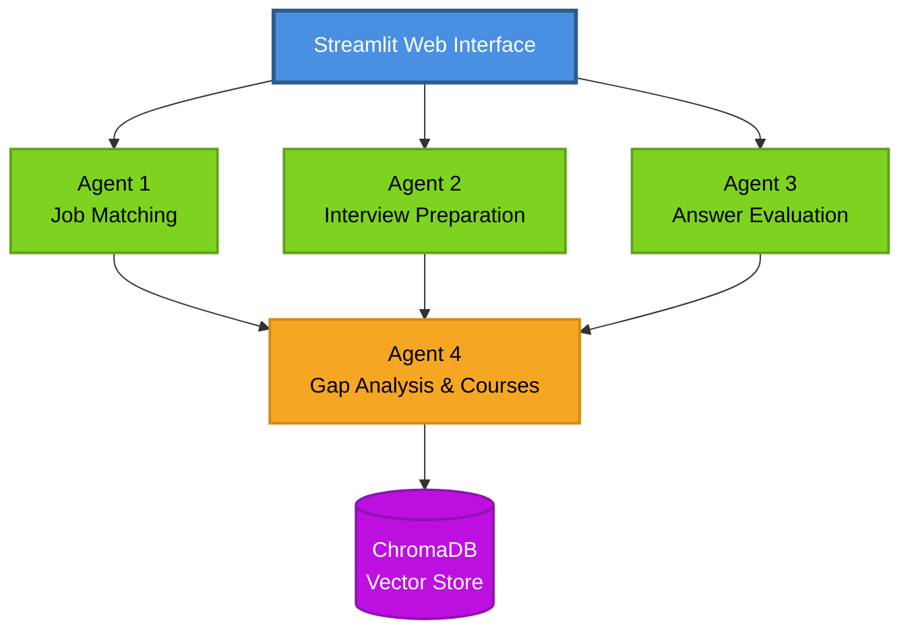

# Multi-Agent AI System

A comprehensive Multi-Agent AI System built with LangGraph that streamlines recruitment and learning processes. The system includes four specialized agents for job matching, interview preparation, answer evaluation, and gap analysis with personalized course recommendations.

## 🌟 Features

### Agent 1: Job Matching
- 🔍 **Intelligent Resume Analysis**: Uses Azure OpenAI GPT-4o to extract skills, experience, and education
- 📋 **Job Description Parsing**: Automatically identifies PRIMARY (required) and SECONDARY (preferred) skills
- 🎯 **Weighted Scoring**: Prioritizes must-have skills (70%) over nice-to-have skills (30%)
- 📊 **Comprehensive Reports**: Detailed match analysis with strengths, gaps, and recommendations

### Agent 2: Interview Preparation
- 📝 **Dynamic Question Generation**: Creates tailored interview questions based on job requirements
- 🎚️ **Difficulty Levels**: Generates questions at Easy, Medium, and Hard levels
- 💡 **Expected Answers**: Provides key points interviewers should look for
- 🔄 **Follow-up Questions**: Includes probing questions for deeper assessment

### Agent 3: Answer Evaluation
- ✅ **Practical-Focused Scoring**: Emphasizes real-world understanding (70%) over theory (30%)
- 📊 **Detailed Feedback**: Identifies strengths, weaknesses, and missing practical aspects
- 🎯 **Skills Assessment**: Pinpoints demonstrated and missing practical skills
- 📈 **Overall Evaluation**: Aggregated scores with comprehensive summary

### Agent 4: Gap Analysis & Learning Recommendations
- 🎓 **Course Recommendations**: AI-powered suggestions from course catalog (2000+ courses)
- 🔍 **Vector Search**: ChromaDB-powered semantic course matching
- 📚 **Learning Paths**: Structured sequence of courses to fill skill gaps
- ⏱️ **Time Estimates**: Projected learning duration for each course

## 🏗️ Architecture

This is a sophisticated **Multi-Agent System** where each agent operates independently while sharing data through a common state management system. For comprehensive architecture details, see **[ARCHITECTURE.md](ARCHITECTURE.md)**.

### High-Level System Design



### 🔗 Documentation

- **[ARCHITECTURE.md](ARCHITECTURE.md)** - Complete system architecture with:
  - Detailed agent pipeline diagrams
  - Data flow visualization
  - Weighted scoring formulas (Job Matching & Answer Evaluation)
  - Technology stack details
  - LangGraph workflow implementation
  - Vector store integration

- **[LOGGING.md](LOGGING.md)** - Comprehensive logging guide:
  - Logger usage and configuration
  - Log levels and formatting
  - Best practices
  - Troubleshooting with logs

- **[QUICKSTART.md](QUICKSTART.md)** - Quick setup and usage guide

## 🛠️ Technology Stack

- **Frontend**: Streamlit web application
- **AI/ML**: Azure OpenAI (GPT-4o), LangGraph, LangChain
- **Vector Database**: ChromaDB for course recommendations
- **Data Processing**: pandas, openpyxl, PyPDF2, python-docx
- **State Management**: Pydantic models
- **Logging**: Professional logging system with rotation

## 📊 Weighted Scoring System

### Job Matching Score
```
Match Score = (0.7 × Primary Skills Match) + (0.3 × Secondary Skills Match)
```
- **70% weight** on PRIMARY (required) skills
- **30% weight** on SECONDARY (preferred) skills
- Reflects real hiring priorities

### Answer Evaluation Score
```
Overall Score = (0.7 × Practical Score) + (0.3 × Theoretical Score)
```
- **70% weight** on practical, hands-on understanding
- **30% weight** on theoretical knowledge
- Emphasizes job-readiness

See [ARCHITECTURE.md](ARCHITECTURE.md) for detailed scoring formulas and examples.

## Installation

1. Clone the repository:
```bash
git clone <repository-url>
cd <repository-name>
```

2. Install dependencies:
```bash
pip install -r requirements.txt
```

3. Set up environment variables:
Create a `.env` file in the root directory:
```
OPENAI_API_KEY=your_openai_api_key_here
```

## Usage

### Streamlit Web Interface (Recommended)

Launch the interactive web interface:

```bash
streamlit run streamlit_app.py
```

This opens a user-friendly web interface where you can:
- Paste or upload job descriptions (supports TXT, PDF, DOCX, DOC formats)
- Add multiple resumes (paste text or upload files in TXT, PDF, DOCX, DOC formats)
- View interactive analysis results
- Download results as text files

### Basic Command Line Usage

Run the main script with example data:

```bash
python main.py
```

This will run a demonstration with sample job descriptions and resumes.

### Programmatic Usage

```python
from src.config.config import Config
from src.graph_builder.job_match_graph import JobMatchGraphBuilder

# Initialize LLM
llm = Config.get_llm()

# Create graph builder
graph_builder = JobMatchGraphBuilder(llm)
graph_builder.build()

# Define job description
job_description = """
Senior Software Engineer position requiring:
- 5+ years Python experience
- Machine learning expertise
- Cloud platform experience (AWS/GCP/Azure)
"""

# Define resumes
resumes = [
    {
        "name": "Jane Doe",
        "content": "Jane Doe - 7 years Python, TensorFlow, AWS..."
    },
    {
        "name": "John Smith", 
        "content": "John Smith - 3 years Python, React..."
    }
]

# Run analysis
result = graph_builder.run(job_description, resumes)

# Access results
for match in result.candidate_matches:
    print(f"{match.resume_name}: {match.match_score}/100")
    print(f"Matched Skills: {match.matched_skills}")
    print(f"Missing Skills: {match.missing_skills}")
    print(f"Gaps: {match.gaps}")
    print(f"Strengths: {match.strengths}")
```

### Custom Integration

You can integrate the job matching agent into your own application:

```python
from src.state.job_match_state import JobMatchState
from src.graph_builder.job_match_graph import JobMatchGraphBuilder

# Your custom job description and resumes
job_desc = load_job_description_from_database()
resumes = load_resumes_from_storage()

# Run analysis
result = graph_builder.run(job_desc, resumes)

# Get best candidate
best_fit = result.best_candidate
print(f"Best candidate: {best_fit.resume_name}")
print(f"Match score: {best_fit.match_score}")
```

## 📁 Project Structure

```
.
├── streamlit_app.py                 # Streamlit web interface (MAIN ENTRY)
├── main.py                          # CLI entry point
├── ARCHITECTURE.md                  # Complete system architecture
├── LOGGING.md                       # Logging documentation
├── QUICKSTART.md                    # Quick start guide
├── data/
│   └── Course Master List.xlsx     # Course catalog (2000+ courses)
├── src/
│   ├── config/
│   │   └── config.py               # Azure OpenAI configuration
│   ├── state/
│   │   ├── job_match_state.py      # Agent 1 state
│   │   ├── interview_prep_state.py # Agent 2 state
│   │   ├── answer_eval_state.py    # Agent 3 state
│   │   └── gap_analysis_state.py   # Agent 4 state
│   ├── node/
│   │   ├── job_match_nodes.py      # Agent 1 nodes
│   │   ├── interview_prep_nodes.py # Agent 2 nodes
│   │   ├── answer_eval_nodes.py    # Agent 3 nodes
│   │   └── gap_analysis_nodes.py   # Agent 4 nodes
│   ├── graph_builder/
│   │   ├── job_match_graph.py      # Agent 1 workflow
│   │   ├── interview_prep_graph.py # Agent 2 workflow
│   │   ├── answer_eval_graph.py    # Agent 3 workflow
│   │   └── gap_analysis_graph.py   # Agent 4 workflow
│   ├── vectorstore/
│   │   └── course_vectorstore.py   # ChromaDB integration
│   └── utils/
│       ├── logger.py               # Professional logging system
│       └── document_parser.py      # PDF/DOCX parsing
├── logs/                            # Auto-generated log files
│   ├── application.log             # All application logs
│   └── error.log                   # Error logs only
└── requirements.txt                 # Python dependencies
```

## Configuration

Edit `src/config/config.py` to customize:

- **LLM Model**: Change `LLM_MODEL` to use different OpenAI models
- **API Keys**: Set environment variables for different providers

## Requirements

- Python 3.8+
- OpenAI API key
- Dependencies listed in `requirements.txt`:
  - langchain
  - langchain-core
  - langchain-openai
  - langgraph
  - pydantic
  - python-dotenv

## Example Output

```
🤖 Job Matching Agent with LangGraph
================================================================================

📊 RESULTS - All Candidates (Ranked by Match Score)
================================================================================

#1 Rank
📋 Candidate: John Smith
   Match Score: 92.0/100

   ✅ Matched Skills: Python, TensorFlow, PyTorch, AWS, Docker, Kubernetes, REST APIs
   ❌ Missing Skills: None

   💪 Strengths:
      • 7+ years of Python experience exceeds requirement
      • Strong ML framework expertise with both TensorFlow and PyTorch
      • Leadership experience managing technical teams

   ⚠️  Gaps:
      • No explicit mention of vector database experience
      • Could benefit from more LangChain experience

   📝 Summary: Excellent fit with strong technical background and leadership experience.
```

## Troubleshooting

### Common Issues

1. **API Key Error**: Ensure your `.env` file contains a valid OpenAI API key
2. **Import Errors**: Run `pip install -r requirements.txt` to install all dependencies
3. **JSON Parsing Errors**: The LLM occasionally returns malformed JSON; the code includes error handling

## Future Enhancements

- [x] Support for PDF and DOCX resume parsing ✅
- [x] Web interface for easy interaction ✅
- [ ] Batch processing for large candidate pools
- [ ] Integration with ATS systems
- [ ] Multi-language support
- [ ] Customizable scoring algorithms
- [ ] Email notification system
- [ ] Interview question generation based on gaps

## Contributing

Contributions are welcome! Please feel free to submit pull requests or open issues.

## License

This project is provided as-is for educational and commercial use.
